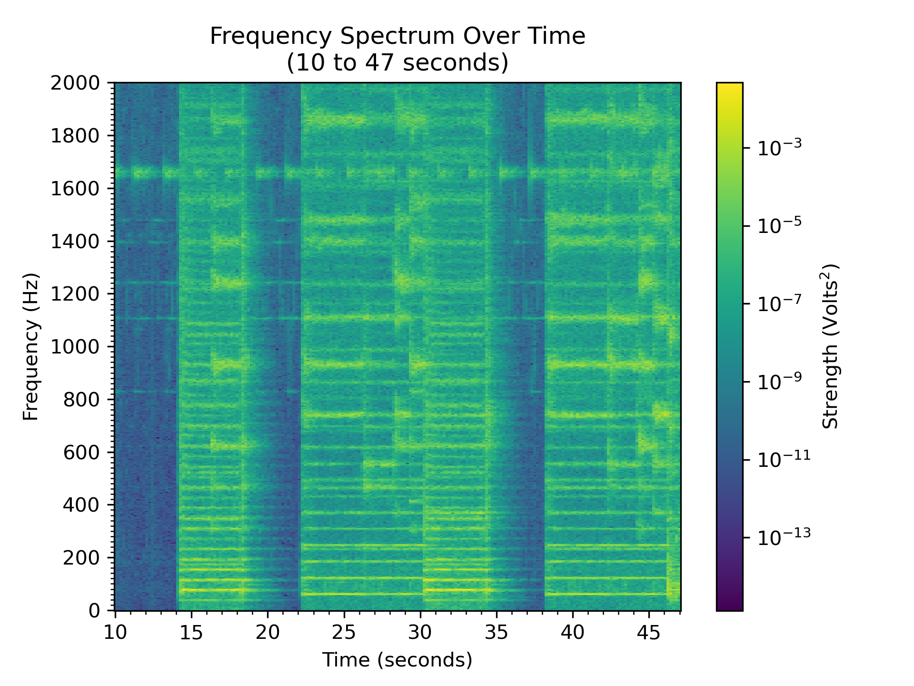
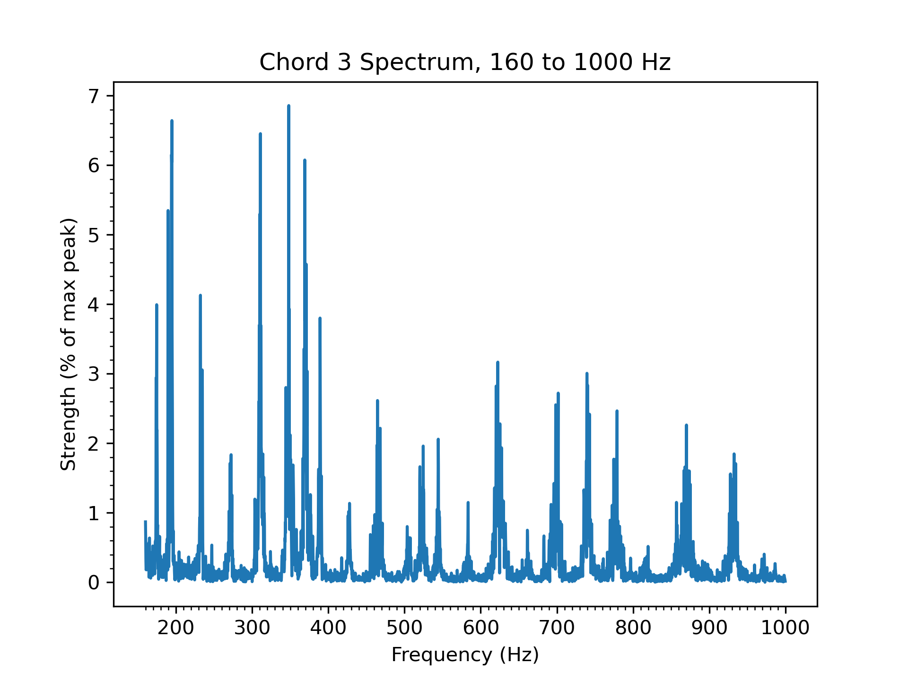
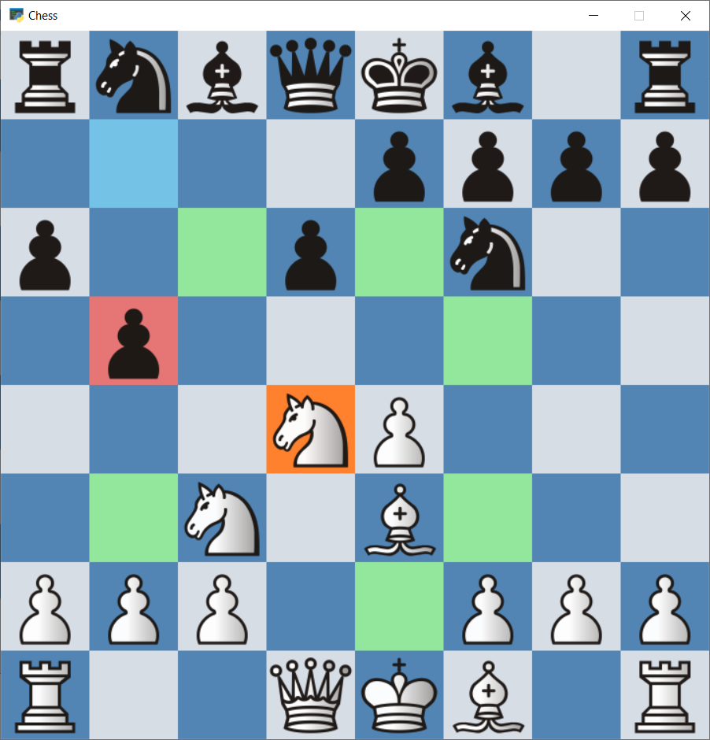

# Zachary Chartrand Portfolio

## Data Analysis

### Project 1: [Analysis of Music Chords](https://github.com/zachartrand/Audio-Analysis/blob/master/pokemon_audio.ipynb)

This project is an analysis of vocal and instrument chords in the
Area Zero music track of Pokémon Scarlet and Violet. The beginning
of the track has many sustained chords, including a dissonant
stacked chord, finding the notes of which was the motivation of
this project.





### Project 2: [Jeopardy Project](https://github.com/zachartrand/Codecademy/tree/master/Data%20Scientist%20Track/Hands%20On%20with%20Pandas/Jeopardy%20Project)

Investigation of a dataset of over 216,000 Jeopardy! questions and
answers. Project from Codecademy.

## Object-Oriented Programming

### Project 1: [Quaternions](https://github.com/zachartrand/Quaternions)

Module for doing mathematics with quaternions, the 4-dimensional analogue of complex numbers.

```python3
>>> q1, q2 = Quaternion(1, -2, -3, 4), Quaternion(1, 4, -3, -2)
>>> print(q1)
(1 - 2i - 3j + 4k)
>>> print(q2)
(1 + 4i - 3j - 2k)
>>> print(q1+q2)
(2 + 2i - 6j + 2k)
>>> print(q1-q2)
(-6i + 0j + 6k)
>>> print(q2-q1)
(6i + 0j - 6k)
>>> print(q1*q2)
(8 + 20i + 6j + 20k)
>>> print(q2*q1)
(8 - 16i - 18j - 16k)
>>> print(q1/q2)
(-0.19999999999999996 - 0.8i - 0.4j - 0.4k)
>>> print(1/q2 * q1)
(-0.19999999999999996 + 0.4i + 0.4j + 0.8k)
>>> print(q2/q1)
(-0.19999999999999996 + 0.8i + 0.4j + 0.4k)
```

### Project 2: [Chess](https://zachartrand.github.io/Chess/)

A simple chess game made with PyGame.



### Project 3: [Playing Cards](https://github.com/zachartrand/Playing-Cards)

Objects and methods for manipulating a deck of playing cards.
